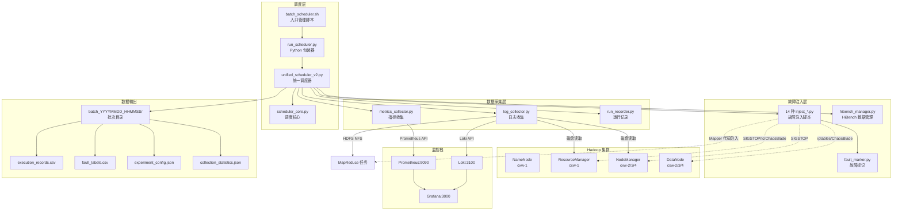
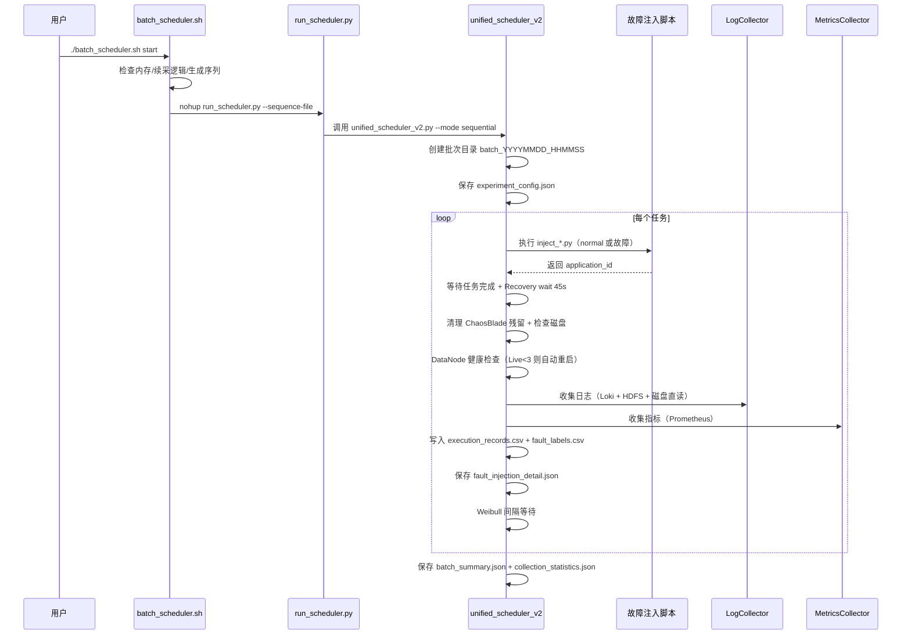

# FaultLLM — Hadoop 集群故障注入与诊断数据集采集系统

## 项目简介

FaultLLM 是一个面向 Hadoop 集群的故障注入与多模态数据采集系统，旨在为基于 LLM 的故障根因分析研究构建高质量数据集。系统通过在真实 4 节点 Hadoop 集群中注入 14 种典型故障，自动采集日志、指标和拓扑数据，并生成带标签的监督学习样本。

### 核心能力

- **14 种故障类型**：覆盖数据分布、任务执行、调度、节点管理、网络、日志异常、硬件 7 大类
- **多模态数据采集**：Prometheus 指标 + Loki 日志 + HDFS MapReduce 日志 + RM/NM 磁盘日志
- **批量调度**：支持数千次任务的自动分批执行，断点续采，加权故障分布
- **安全恢复**：每次注入后自动清理残留、检查 DataNode 健康、必要时自动重启
- **监控可视化**：实时进度、内存/磁盘状态、ETA 预估、历史批次统计

### 集群拓扑

| 节点 | 角色 | 服务 | IP |
|------|------|------|-----|
| cxw-1 | Master | NameNode, ResourceManager, HistoryServer | 10.10.0.82 |
| cxw-2 | Worker | DataNode, NodeManager | 10.10.0.124 |
| cxw-3 | Worker | DataNode, NodeManager | 10.10.2.188 |
| cxw-4 | Worker | DataNode, NodeManager | 10.10.0.92 |

- Hadoop 版本：3.3.6
- HDFS 副本数：3
- 监控组件：Prometheus (9090) + Loki (3100) + Grafana (3000)
- ChaosBlade 路径：`/opt/chaosblade-1.7.2/blade`
- HiBench 路径：`/opt/HiBench`

---

## 系统架构



### 模块职责

| 模块 | 路径 | 职责 |
|------|------|------|
| `batch_scheduler.sh` | `data/data_scripts/` | 入口管理脚本，启动/停止/状态查询/内存清理 |
| `run_scheduler.py` | `data/data_scripts/` | Python 包装器，从序列文件读取任务并调用主调度器 |
| `unified_scheduler_v2.py` | `data/data_scripts/collect_data/` | 主调度器，编排故障注入、数据采集、记录写入 |
| `scheduler_core.py` | `data/data_scripts/collect_data/` | 调度核心逻辑，序列生成、间隔控制 |
| `unified_config.py` | `data/data_scripts/collect_data/` | 统一配置：集群拓扑、故障定义、指标列表 |
| `log_collector.py` | `data/data_scripts/collect_data/` | 日志收集：Loki + HDFS NFS + RM/NM 磁盘直读 |
| `metrics_collector.py` | `data/data_scripts/collect_data/` | 指标收集：Prometheus 查询 |
| `run_recorder.py` | `data/data_scripts/collect_data/` | 运行记录写入 CSV |
| `hibench_manager.py` | `data/data_scripts/collect_data/` | HiBench 测试数据生成管理 |
| `fault_marker.py` | `data/data_scripts/collect_data/` | 故障注入标记日志，便于验证 |
| `enhanced_status.py` | `data/data_scripts/collect_data/` | 增强状态监控（进度/内存/磁盘/ETA） |
| `safe_cleanup.py` | `data/data_scripts/` | 安全清理不完整样本（只删样本目录，不删批次） |

---

## 14 种故障类型说明

系统实现了 14 种故障类型（标签 1–14），加上正常基准（标签 0），共 15 个类别。故障分布基于真实场景频率加权，参考清华/百度 DSN 2017 故障分布数据。

| 标签 | 故障类型 | 类别 | 注入方式 | 受影响节点 | 权重 |
|------|---------|------|---------|-----------|------|
| 0 | wordcount (normal) | 基准 | 标准 WordCount/Sort/Terasort | — | — |
| 1 | wait_time | 调度 | SIGSTOP 挂起 ResourceManager 120s | cxw-1 | 6 |
| 2 | exit_time | 节点管理 | SIGSTOP 挂起 NodeManager 120s | cxw-2/3/4 | 6 |
| 3 | runtime_delta | 调度 | SIGSTOP 挂起 MRAppMaster 120s | cxw-2/3/4 | 6 |
| 4 | data_skew | 数据分布 | Mapper 80% 概率输出相同 key | cxw-2/3/4 | 7 |
| 5 | data_bloat | 数据分布 | Mapper 输出多倍中间数据 | cxw-2/3/4 | 6 |
| 6 | task_fail | 任务执行 | Mapper 随机抛 RuntimeException (20%) | cxw-2/3/4 | 7 |
| 7 | long_tail | 任务执行 | 指定 Mapper sleep 60s | cxw-2/3/4 | 6 |
| 8 | network_latency | 网络 | tc 命令注入 100ms 网络延迟 | 全节点 | 9 |
| 9 | log_level_change | 日志异常 | Hadoop logLevel Servlet 改 INFO→DEBUG | cxw-2 | 6 |
| 10 | process_restart | 节点管理 | Kill 并延迟重启 DataNode | cxw-2 | 8 |
| 11 | heartbeat_timeout | 节点管理 | iptables 屏蔽 DataNode 心跳端口 | cxw-2 | 9 |
| 12 | disk_error | 硬件 | ChaosBlade 注入磁盘 IO 错误 | cxw-2/3 | 11 |
| 13 | disk_full | 硬件 | ChaosBlade disk fill 填充至 90% | cxw-2 | 6 |
| 14 | network_loss | 网络 | ChaosBlade network loss 30% 丢包 | cxw-2 | 7 |

### 故障分类

| 类别 | 故障类型 |
|------|---------|
| 基准 (baseline) | normal |
| 数据分布 (data_distribution) | data_skew, data_bloat |
| 任务执行 (task_execution) | task_fail, long_tail |
| 调度 (scheduling) | wait_time, runtime_delta |
| 节点管理 (node_management) | exit_time, process_restart, heartbeat_timeout |
| 网络 (network) | network_latency, network_loss |
| 日志异常 (log_anomaly) | log_level_change |
| 硬件 (hardware) | disk_error, disk_full |

### 注入工具分层

| 层级 | 工具 |
|------|------|
| 代码级 | 自定义 Mapper/Reducer + Hadoop Streaming |
| 进程级 | SIGSTOP/SIGCONT, kill + daemon restart |
| 网络级 | ChaosBlade, iptables, tc |
| 系统级 | HDFS 权限修改, Hadoop logLevel Servlet |

---

## 安装部署

### 环境要求

- **操作系统**：Ubuntu 22.04
- **Python**：3.10+
- **Hadoop**：3.3.6（安装于 `/opt/hadoop`）
- **HiBench**：安装于 `/opt/HiBench`
- **ChaosBlade**：1.7.2（安装于 `/opt/chaosblade-1.7.2`）
- **监控栈**：Prometheus + Loki + Grafana + Node Exporter + JMX Exporter

### Python 依赖

```bash
pip install requests pandas numpy
```

### 前置条件

1. **SSH 免密登录**：cxw-1 可免密 SSH 到 cxw-2/3/4
2. **sudo 免密**：故障注入脚本需要 sudo 权限（ChaosBlade、drop_caches、iptables）
3. **Hadoop 服务运行**：NameNode、ResourceManager、HistoryServer、3 个 NodeManager、3 个 DataNode
4. **监控服务运行**：Prometheus、Loki、Grafana
5. **JMX Exporter 端口**：
   - 9100：node_exporter
   - 9404：NameNode
   - 9405：DataNode
   - 9406：ResourceManager
   - 9407：NodeManager
6. **HDFS NFS 挂载**：`/hdfs-nfs`（可选，用于 MapReduce 日志收集）

### 目录结构

```
fault_injection_clean/
├── data/
│   ├── data_scripts/                      # 主代码目录
│   │   ├── batch_scheduler.sh             # 入口管理脚本
│   │   ├── run_scheduler.py               # Python 包装器
│   │   ├── safe_cleanup.py                # 安全清理工具
│   │   ├── check_status.py                # 状态查看（简版）
│   │   ├── collect_data/                  # 核心模块
│   │   │   ├── unified_scheduler_v2.py    # 主调度器
│   │   │   ├── scheduler_core.py          # 调度核心
│   │   │   ├── unified_config.py          # 统一配置
│   │   │   ├── log_collector.py           # 日志收集
│   │   │   ├── metrics_collector.py       # 指标收集
│   │   │   ├── run_recorder.py            # 运行记录
│   │   │   ├── hibench_manager.py         # HiBench 管理
│   │   │   ├── fault_marker.py            # 故障标记
│   │   │   ├── enhanced_status.py         # 增强状态监控
│   │   │   └── topology_features.py       # 拓扑特征
│   │   ├── common_mapreduce/              # 基准 WordCount
│   │   ├── data_skew/                     # 数据倾斜
│   │   ├── data_bloat/                    # 数据膨胀
│   │   ├── task_fail/                     # 任务失败
│   │   ├── long_tail/                     # 长尾任务
│   │   ├── wait_time/                     # 等待时间异常
│   │   ├── run_time/                      # 运行时间异常
│   │   ├── exit_time/                     # 退出时间异常
│   │   ├── network_latency/               # 网络延迟
│   │   ├── network_loss/                  # 网络丢包
│   │   ├── log_level_change/              # 日志级别变更
│   │   ├── process_restart/               # 进程重启
│   │   ├── heartbeat_timeout/             # 心跳超时
│   │   ├── disk_error/                    # 磁盘错误
│   │   ├── disk_full/                     # 磁盘满
│   │   ├── permission_denied/             # 权限拒绝（备用）
│   │   ├── docs/                          # 文档
│   │   └── logs/                          # 调度器日志
│   └── .gitignore
└── README.md
```

---

## 使用方法

### 快速开始（推荐）

```bash
cd /project/data/data_scripts

# 使用默认配置启动（5000 次任务，90% 正常，14 种故障加权分布）
./batch_scheduler.sh start

# 查看运行状态
./batch_scheduler.sh status

# 停止调度器
./batch_scheduler.sh stop

# 手动清理内存
./batch_scheduler.sh cleanup
```

### 自定义配置启动

```bash
# 100 次任务，20% 正常，自定义故障类型
TOTAL_RUNS=100 NORMAL_RATIO=0.2 \
FAULT_TYPES="data_skew,task_fail,long_tail" \
WORKLOAD=wordcount \
./batch_scheduler.sh start

# 快速测试（小间隔）
INTERVAL_MIN=5 INTERVAL_MAX=10 TOTAL_RUNS=10 ./batch_scheduler.sh start

# 低内存环境
MEMORY_THRESHOLD=300 MEMORY_CLEANUP_INTERVAL=5 ./batch_scheduler.sh start
```

### 直接调用调度器

```bash
cd /project/data/data_scripts/collect_data

# 顺序模式
python3 unified_scheduler_v2.py \
    --mode sequential \
    --sequence "wait_time:2,exit_time:1,wordcount:1" \
    --data-size small \
    --interval-min 60 \
    --interval-max 400 \
    --max-batch-size 50

# 随机模式
python3 unified_scheduler_v2.py \
    --mode random \
    --fault-types wait_time exit_time \
    --fault-counts "wait_time:3,exit_time:2" \
    --normal-count 2 \
    --data-size small
```

### 单独执行故障注入

```bash
cd /project/data/data_scripts

# 基准任务
python3 common_mapreduce/inject_wordcount.py

# 数据分布类
python3 data_skew/inject_data_skew.py
BLOAT_FACTOR=10 python3 data_bloat/inject_data_bloat.py

# 任务执行类
TASK_FAIL_RATIO=0.5 python3 task_fail/inject_task_fail.py
LONG_TAIL_DURATION=60 python3 long_tail/inject_long_tail.py

# 调度类
python3 wait_time/inject_wait_time.py
python3 run_time/inject_runtime_delta.py

# 节点管理类
python3 exit_time/inject_exit_time.py
python3 process_restart/inject_process_restart.py
python3 heartbeat_timeout/inject_heartbeat_timeout.py

# 网络类
python3 network_latency/inject_network_latency.py
python3 network_loss/inject_network_loss.py

# 日志异常
python3 log_level_change/inject_log_level_change.py

# 硬件类
python3 disk_error/inject_disk_error.py
python3 disk_full/inject_disk_full.py
```

---

## 配置说明

### 环境变量（batch_scheduler.sh）

| 变量 | 说明 | 默认值 |
|------|------|--------|
| `TOTAL_RUNS` | 总任务数 | 5000 |
| `NORMAL_RATIO` | 正常任务比例 | 0.90 |
| `FAULT_TYPES` | 故障类型（逗号分隔） | 14 种（不含 permission_denied） |
| `INTERVAL_MIN` | 最小间隔秒数 | 30 |
| `INTERVAL_MAX` | 最大间隔秒数 | 120 |
| `DATA_SIZE` | 数据规模 | medium |
| `MAX_BATCH_SIZE` | 每批次最大任务数 | 50 |
| `WORKLOAD` | 工作负载类型 | wordcount |
| `MEMORY_THRESHOLD` | 内存阈值（MB），低于此值触发清理 | 500 |
| `MEMORY_CLEANUP_INTERVAL` | 每 N 个任务检查一次内存 | 10 |

### 调度器命令行参数（unified_scheduler_v2.py）

| 参数 | 说明 | 默认值 |
|------|------|--------|
| `--mode` | 调度模式：sequential / random | sequential |
| `--sequence` | 顺序模式序列，格式 `fault_type:count,...` | — |
| `--fault-types` | 随机模式故障类型列表 | data_skew task_fail long_tail |
| `--fault-counts` | 随机模式故障数量 `fault_type:count,...` | — |
| `--normal-count` | 随机模式 normal 任务数量 | 0 |
| `--data-size` | 数据规模：tiny/small/large/huge/gigantic | small |
| `--workload` | 工作负载：random/wordcount/sort/terasort | random |
| `--interval-min` | 最小间隔（秒） | 60 |
| `--interval-max` | 最大间隔（秒，Weibull 截断上限） | 300 |
| `--max-batch-size` | 每批次最大任务数 | 50 |
| `--output-dir` | 输出目录 | collect_data/data |
| `--skip-prepare` | 跳过 HiBench 数据准备 | False |

### 数据规模

| 规模 | 大小 | 用途 |
|------|------|------|
| tiny | ~32MB | 快速验证 |
| small | ~320MB | 开发测试 |
| large | ~32GB | 性能测试 |
| huge | ~320GB | 压力测试 |
| gigantic | ~3.2TB | 极限测试 |

### 核心配置文件（unified_config.py）

| 配置项 | 说明 |
|--------|------|
| `PROMETHEUS_API` | Prometheus API 地址（`http://localhost:9090/api/v1`） |
| `LOKI_API` | Loki API 地址（`http://localhost:3100/loki/api/v1`） |
| `HDFS_NFS_MOUNT` | HDFS NFS 挂载点（`/hdfs-nfs`） |
| `HADOOP_HOME` | Hadoop 安装路径（`/opt/hadoop`） |
| `TOPOLOGY` | 集群拓扑：master、slaves、roles、services |
| `FAULT_CONFIG` | 14 种故障类型配置（描述、注入方法、受影响节点、类别） |
| `METRICS_CONFIG` | 6 类指标配置（cpu/memory/disk/network/hadoop/jvm） |
| `DEFAULT_FAULT_PARAMS` | 默认故障参数（fault_duration=120s） |

---

## 调度器说明

### 调度流程



### 间隔分布

任务间隔采用 **Weibull 分布**（k=1.5, λ=180），截断到 `[interval_min, interval_max]` 区间。该分布参考数据中心故障间隔的真实统计特性（DSN 2017）。

### 故障加权分布

故障类型按真实场景频率加权分配，权重定义在 `batch_scheduler.sh` 和 `enhanced_status.py` 中：

| 故障类型 | 权重 | 故障类型 | 权重 |
|---------|------|---------|------|
| disk_error | 11 | data_bloat | 6 |
| heartbeat_timeout | 9 | wait_time | 6 |
| network_latency | 9 | exit_time | 6 |
| process_restart | 8 | runtime_delta | 6 |
| task_fail | 7 | long_tail | 6 |
| data_skew | 7 | log_level_change | 6 |
| network_loss | 7 | disk_full | 6 |

分配算法：先保证每种故障至少 30 个样本（统计有效性），剩余按权重比例分配。

### 续采（断点续传）

启动时自动扫描已有批次目录的 `fault_labels.csv`，统计每种故障类型已采集数量，计算缺口并生成补缺口序列。若已采集总数达到 `TOTAL_RUNS` 目标则直接退出。

### 安全恢复机制

每次故障注入后执行：
1. **Recovery wait**：45 秒等待故障效应完全消散
2. **ChaosBlade 残留清理**：删除 `/chaos_filldisk.log.dat`、`/chaos_burnio.*`、`/tmp/disk_stress` 等临时文件
3. **磁盘使用率检查**：任一节点 >90% 则告警
4. **DataNode 健康检查**：`hdfs dfsadmin -report` 检查 Live DataNode 数量，<3 则自动重启 dead 节点的 DataNode

---

## 数据采集流程

### 数据源

| 数据类型 | 来源 | 收集方式 |
|---------|------|---------|
| 系统指标 | Prometheus | HTTP API 查询（cpu/memory/disk/network） |
| Hadoop 指标 | Prometheus + JMX Exporter | HTTP API 查询（namenode/datanode/RM/NM/MapReduce） |
| JVM 指标 | Prometheus + JMX Exporter | HTTP API 查询（heap/gc/threads） |
| Hadoop 日志 | Loki | LogQL 查询（时间窗口：任务前 10 分钟 ~ 后 15 分钟） |
| MapReduce 日志 | HDFS Log Aggregation | HDFS NFS 挂载点读取 |
| RM/NM 日志 | 节点磁盘 | SSH + 按时间窗口过滤直接读取 |

### 批次目录结构

```
collect_data/data/
└── batch_20260529_120000/                    # 批次目录
    ├── execution_records.csv                 # 执行记录（14 字段）
    ├── fault_labels.csv                      # 故障标签（监督学习用）
    ├── experiment_config.json                # 实验配置（论文复现用）
    ├── collection_statistics.json            # 采集统计摘要
    ├── batch_summary.json                    # 批次摘要
    └── <fault_type>_<application_id>_<ts>/   # 任务目录
        ├── fault_injection_detail.json       # 故障注入元数据
        ├── logs/
        │   ├── cxw-1/
        │   │   ├── resourcemanager_*.csv      # RM 日志（磁盘直读）
        │   │   └── namenode_*.csv             # NN 日志（Loki）
        │   ├── cxw-2/
        │   │   ├── nodemanager_*.csv          # NM 日志（磁盘直读）
        │   │   ├── datanode_*.csv             # DN 日志（Loki）
        │   │   └── mapreduce_application_*_*.csv  # MR 日志（HDFS）
        │   └── ...
        └── metrics/
            ├── cxw-1/
            │   ├── hadoop_resourcemanager_*.csv
            │   ├── hadoop_namenode_*.csv
            │   ├── jvm_*.csv
            │   └── node_{cpu,memory,disk,network}_*.csv
            └── ...
```

### execution_records.csv 字段

| 字段 | 说明 |
|------|------|
| seq_idx | 序列索引 |
| fault_type | 故障类型 |
| start_time | 开始时间（ISO） |
| end_time | 结束时间（ISO） |
| duration | 执行时长（秒） |
| success | 是否成功 |
| job_id | Job ID |
| application_id | Application ID |
| logs_dir | 日志目录路径 |
| metrics_dir | 指标目录路径 |
| error | 错误信息（限 500 字符） |
| nodes | 受影响节点 |
| method | 注入方法 |
| task_dir | 任务目录路径 |

### fault_labels.csv 字段

| 字段 | 说明 |
|------|------|
| folder_name | 文件夹名 |
| fault_type | 故障类型 |
| start_time | 开始时间 |
| end_time | 结束时间 |
| label | 故障标签（0=正常，1–14=故障类型） |

### fault_injection_detail.json

每个任务目录下保存故障注入元数据，包含：故障类型、标签、类别、注入方法、受影响节点/服务、时间窗口、workload、集群信息、执行结果、数据收集路径，供论文分析使用。

---

## 监控工具

### enhanced_status.py（增强状态监控）

```bash
python3 /project/data/data_scripts/collect_data/enhanced_status.py
```

输出内容包括：
- **内存状态**：可用内存、使用率、正常/不足标识
- **进程状态**：PID、运行时间、CPU/内存使用率
- **总体采集进度**：进度条、已完成/总计、正常/故障样本数、ETA 预估
- **各故障类别进度**：14 种故障 + normal 的完成/目标/完成率/进度条
- **磁盘使用情况**：数据目录大小、日志目录大小、可用空间
- **最近日志**：最新调度器日志最后 10 行

状态监控从 `data_medium/` 目录扫描 `fault_labels.csv` 统计已采集量，目标值按权重算法计算（TOTAL_TARGET=5000, NORMAL_RATIO=0.898）。

### check_status.py（简版状态查看）

```bash
python3 /project/data/data_scripts/check_status.py
```

只统计有实际数据（logs/ 或 metrics/ 非空）的样本，排除空任务。

### batch_scheduler.sh status

```bash
./batch_scheduler.sh status
```

内部调用 `enhanced_status.py`，显示完整运行状态。

### 历史批次统计

`batch_scheduler.sh` 内置 `get_all_batches_summary()` 函数，可遍历所有 `batch_*` 目录，统计每个批次的执行次数、成功数、故障类型分布，并汇总所有批次的故障类型总分布。

---

## 安全工具

### safe_cleanup.py（安全清理不完整样本）

```bash
# 预览模式（DRY-RUN，默认）
python3 /project/data/data_scripts/safe_cleanup.py --data-dir /project/data/data_scripts/collect_data/data

# 实际执行
python3 /project/data/data_scripts/safe_cleanup.py --data-dir /project/data/data_scripts/collect_data/data --execute
```

**安全保证**：
- 只删除 `metrics/` 目录为空的样本目录
- **绝不删除整个 batch 目录**
- **绝不删除 fault_labels.csv**
- 删除样本后自动重写 fault_labels.csv，保留有效记录
- 即使所有样本无效，也不删除 batch 目录（仅告警提示手动处理）

### batch_scheduler.sh cleanup（内存清理）

```bash
./batch_scheduler.sh cleanup
```

执行 `sync` + `echo 3 > /proc/sys/vm/drop_caches` 清理系统缓存，显示清理前后的可用内存和释放量。需要 sudo 权限。

### 自动安全机制

调度器内置以下自动安全机制：
1. **启动前内存检查**：可用内存 <500MB 则自动清理，清理后仍不足则拒绝启动
2. **运行中内存监控**：每 10 个任务检查一次内存，低于阈值自动清理
3. **故障后残留清理**：每次故障注入后清理 ChaosBlade 临时文件
4. **DataNode 自动重启**：Live DataNode <3 时自动重启 dead 节点
5. **磁盘使用率告警**：任一节点磁盘 >90% 则告警
6. **优雅退出**：收到 SIGTERM/SIGINT 后完成当前任务再退出

---

## 注意事项

1. **SSH 免密**：cxw-1 必须可免密 SSH 到 cxw-2/3/4
2. **sudo 权限**：ChaosBlade、drop_caches、iptables 需要 sudo（建议免密）
3. **监控服务**：确保 Prometheus 和 Loki 服务正常运行
4. **HiBench 数据**：首次使用需调用 HiBench prepare 脚本生成测试数据
5. **后台运行**：`batch_scheduler.sh` 使用 `nohup` 启动，SSH 断开后继续运行
6. **PID 文件**：`/tmp/batch_scheduler.pid` 和 `/tmp/scheduler_python.pid` 用于状态监控
7. **序列文件**：`/tmp/batch_sequence.txt` 保存当前执行序列
8. **批次文件**：`/tmp/batch_scheduler.batch` 保存当前批次目录路径
9. **日志位置**：`/project/data/data_scripts/logs/scheduler_YYYYMMDD_HHMMSS.log`
10. **磁盘空间**：建议每 ~10 天检查磁盘空间，数据增长较快

---

## 相关文档

- [故障分类与实现指南](data/data_scripts/docs/fault_classification.md)
- [调度器使用指南](data/data_scripts/docs/scheduler_usage_guide.md)
- [故障标记使用指南](data/data_scripts/docs/fault_marker_guide.md)
- [MapReduce 标记使用指南](data/data_scripts/docs/mr_marker_usage_guide.md)
- [拓扑数据构建指南](data/data_scripts/docs/topology_guide.md)
- [监督学习标签说明](data/data_scripts/docs/supervised_learning_labels.md)
- [项目当前状态](data/data_scripts/PROJECT_STATE.md)

---

## 版本历史

- **V3.0**（当前版本）
  - 14 种故障类型完整实现
  - 批次调度（每批最多 50 次）
  - 独立批次目录 + fault_labels.csv 自动生成
  - 续采（断点续传）逻辑
  - Weibull 间隔分布
  - 安全恢复机制（ChaosBlade 清理 + DataNode 自动重启）
  - 增强状态监控（ETA/内存/磁盘）
  - fault_injection_detail.json 元数据
  - experiment_config.json 实验复现配置

- **V2.0**
  - 解耦架构设计（scheduler_core / log_collector / metrics_collector）
  - HiBench 数据规模集成
  - 双调度模式（顺序/随机）
  - 随机间隔调度
